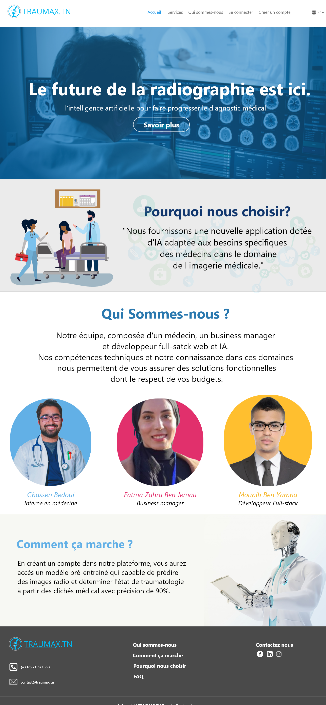
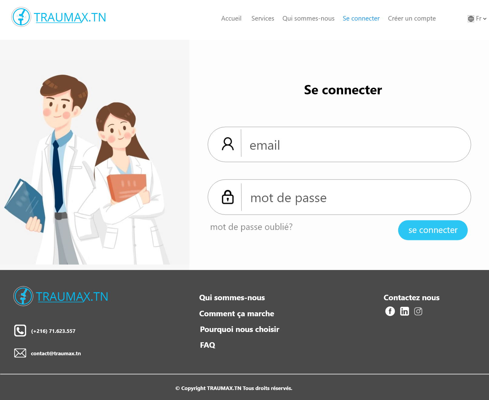

  

## OSTX Competition | Traumax.tn
"Traumax.tn" is a web platform that helps doctors who struggle to interpret a post traumatic x-ray image, in the analyzing process using the 
Artificial Intelligence technology so they can make the right decision. As a result, the doctor will be able to upload x-rays, and our software will analyse the image and give the doctor a detailed result and the percentage of an existing traumatology,
and its type and other informations related to how proceed to the right treatment.

## These are some screenshots of the project:

  

  

  

